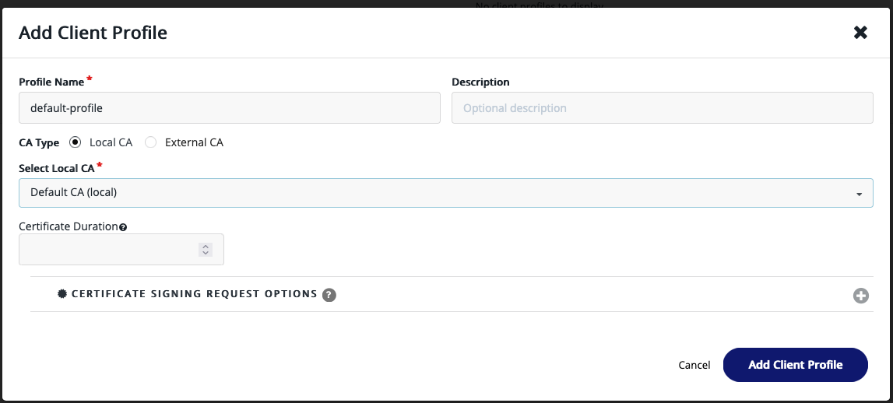
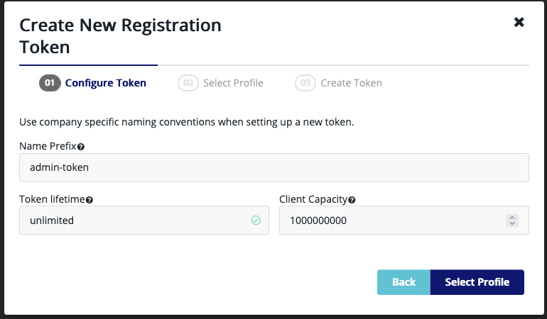
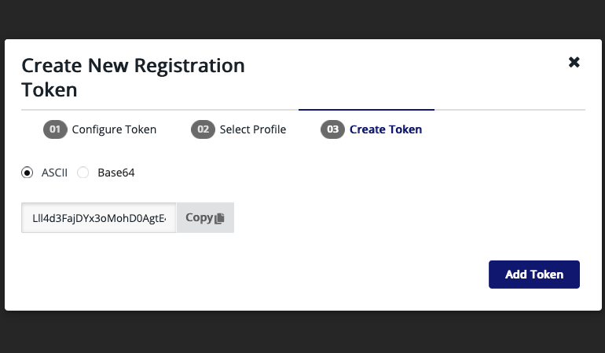

# Setup steps

1. Login to vm on ip with admin:admin and change password

2. Create a client profile

3. Create a registration token

Configure the token with a huge set of token refereshes

Select your admin profile

Copy the ascii file into your `values-secrets` file.

