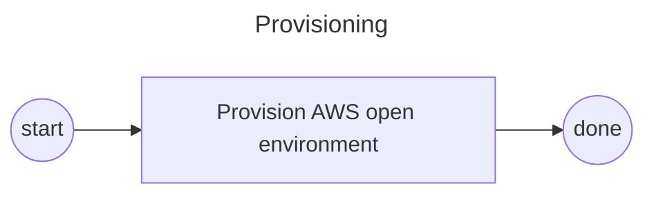
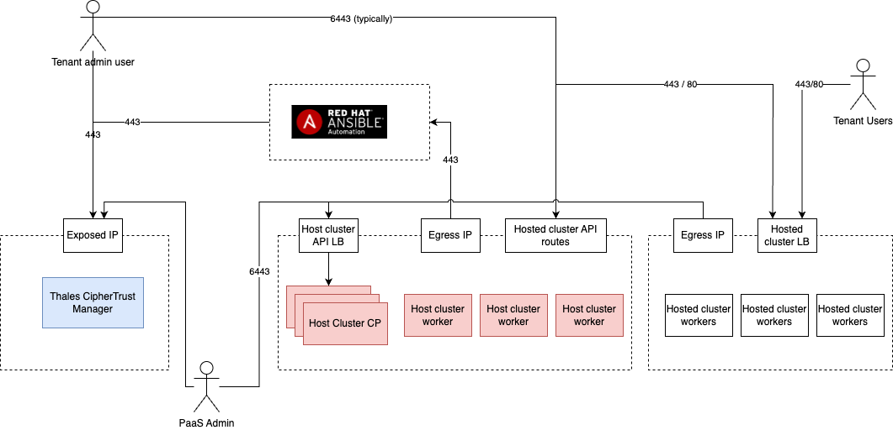

# Environment setup
This is currenly based on the experience of using Red Hat's Demo Platform (RHDP)
Optimal ordering depends on the infrastructure environment and available automation.


## Workflow




## High level workflow


## Network requirements



The network environment setup for this demo varies based the underlying infrastructure on which the system is deployed.

At a conceptual level there are four components:

- The host cluster
- The hosted clusters
- The Thales CipherTrust Manager
- An Ansible Automation Platform deployment

The diagram above shows the critical network connections in an environment where each appliance is network isolated.

## AAP Deployment
The default method to deploy ansible automation platform in this pattern is deployed on the cluster.
This can easily be overriden by configuring 

```yaml

global:
    aapURL: https://my-aap.server.com 
```

in `values-global.yaml`


## Secrets injection and required secrets for pre-flight setup
This repo uses the [validated-patterns secret file](https://validatedpatterns.io/learn/workflow/#consuming-a-pattern) to inject secrets into Hashicorp Vault. The [template file](../values-secret.yaml.template) should be copied to `~/values-secret-encrypted-control-planes.yaml` and populated.

The following secrets SHOULD be pre-poplulated before deploying the validated-patterns operator into the cluster:

- aap-manifest (if deploying aap on OCP)
  - [See here](https://access.redhat.com/documentation/en-us/red_hat_ansible_automation_platform/2.3/html/red_hat_ansible_automation_platform_operations_guide/assembly-aap-obtain-manifest-files)
- Pull secret for OCP container images
  - Get from [here](https://console.redhat.com/openshift/install/pull-secret) 
- Pull secret for docker hub for CTE (public dockerhub credentials)
  - If using `podman` the file is here:  `~/.config/containers/auth.json`


